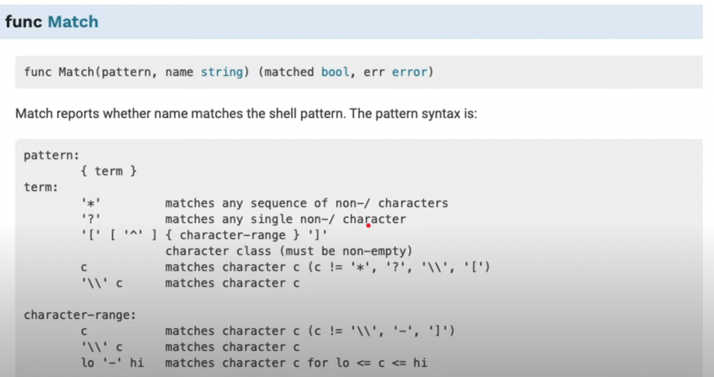

# Golang Embed

Link Pembelajaran <a href="https://www.youtube.com/watch?v=uYYIQWmrsuk&list=PL-CtdCApEFH-0i9dzMzLw6FKVrFWv3QvQ&index=9&ab_channel=ProgrammerZamanNow">Programmer Zaman Now</a>

golang `embed` adalah package mengambil atau membaca file

> Cara menggunakan `embed`

jika hanya ingin nge embed 1 file maka bisa menggunakan cara berikut

```golang
//go:embed version.txt <-
var version string
```

yang mana variable versioan harus di luar func dan karena cara meanggilnya menggunakan comend `//go:embed {name file}` maka package nya tidak aka ke import otomatis maka harus manual dengan cara

```golang
import (
	_ "embed"
)
```

untuk pengambilan file `pic/gambar/image` `png` dan file lainnya, maka bisa menggunakan`[]byte` karena data balikan dari file tersebut adalah bineri

contoh penggunaannya

```golang
//go:embed pic.png
var pic []byte
func main() {
  err := ioutil.WriteFile("pic_nex.png", pic, fs.ModePerm) // membuat file baru atau di duplikat
	if err != nil {
		panic(err)
	}
}
```

untuk memanggil file secara otomatis bisa menggunakan cara berikut, yang mana saya mempuanya kumpulan file di dalam folder files. penggunakan `*` berarti semua file yang ada didalamnya dan `.txt` maka semua file yang `txt`

```golang
//go:embed files/*.txt
var path embed.FS

func main() {
  dirEntries, err := path.ReadDir("files")
	if err != nil {
		panic(err)
	}

	for _, entry := range dirEntries {
		if !entry.IsDir() {
			fmt.Println(entry.Name())
			file, err := path.ReadFile("files/"+ entry.Name())
			if err != nil {
				panic(err)
			}

			fmt.Println(string(file))
		}
	}
}
```


